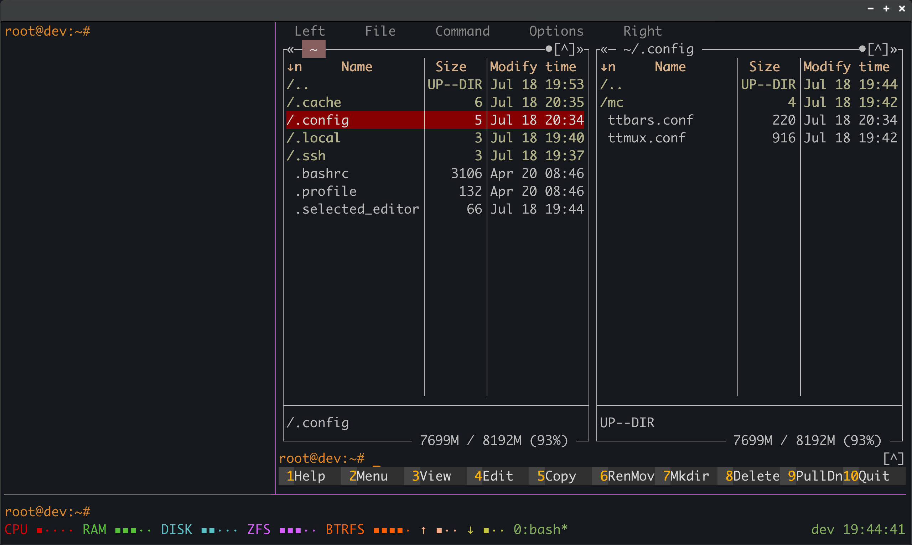
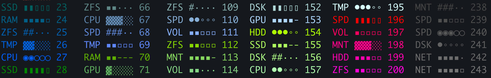

# TurboTmux (ttmux)

<!-- ver: 0+1🆙 # 🚀 TurboTmux: project started -->

TurboTmux is a simple launcher for tmux. It runs without replacing tmux or touching `~/.tmux.conf`. Settings live in its own config `~/.config/ttmux.conf`; start with the `ttmux` command with no flags. You can use it side by side with regular tmux.

Out of the box TurboTmux offers a ready three-pane terminal layout, mouse control, clipboard, and the ttbars plugin for a status line with a monitor of key resources as pseudographic bars (CPU, RAM, DISK, ZFS, Btrfs, network ↑ TX / ↓ RX). With a set of variables you can easily tune pane and bar appearance and set programs to autostart.




---

## Installation methods:

- ### 🌐 one command from the network
    ```bash
    curl -fsSL https://github.com/RootFromHell/ttmux/raw/main/installer.sh | sudo bash -s -- --online
    ```
    Downloads only `ttbars`, `ttmux`, man pages and the conf example, then places them under `/usr/local`.

- ### 📦 get the git repository
    Besides the program it includes this documentation and TurboTmux development scripts.

    ```bash
    git clone https://github.com/RootFromHell/ttmux
    cd ttmux
    sudo ./installer.sh --install
    ```
    The `installer.sh` script installs `ttmux` and `ttbars`, man pages, and a metrics config example into `/usr/local`.

- ### 👨‍🔧 manual installation

    - It is enough to place the `ttmux` and `ttbars` files into `/usr/local/bin`
    - Set permissions: owner `root`, and `r-x` for everyone.

    Dependencies: **tmux** 
    Optional: **mc** (launched in the right pane by default)
    Both packages will be installed with automated installation methods.

- ### 🗑️ uninstall
    if you have the git repository:
    ```bash
    sudo ./installer.sh --uninstall
    ```
    online:
    ```bash
    curl -fsSL https://github.com/RootFromHell/ttmux/raw/main/installer.sh | sudo bash -s -- --uninstall
    ```
    ⚠️ Full cleanup: binaries, man pages, the share example, the invoking user's `~/.config/ttmux.conf`, and metrics cache. Keeps `ttbars.conf` (users create it).

---

## Starting TurboTmux
Simply run in the terminal:
```bash
ttmux
```
this command creates a new _ttmux_ session or attaches to an existing one with no flags.
If you have never used `tmux`, be sure to learn it: TurboTmux is 99% tmux, just a bit friendlier. A small set of hotkeys is usually enough (default prefix is `Ctrl+b`, then the given key):

| Keys | Action |
|------|--------|
| `Ctrl+b`, `d` | Detach from the session: `ttmux` keeps running in the background, the terminal returns to a normal shell |
| `Ctrl+b`, `z` | Zoom the current pane to full screen / restore previous size (zoom/unzoom) |
| `Ctrl+b`, `&`, `y` | Close the current session (tmux will ask for confirmation) |

On first start, if it does not exist, the configuration file `~/.config/ttmux.conf` is created. It holds basic tmux settings: mouse, clipboard, colors, status line. You can edit it later:

```bash
nano ~/.config/ttmux.conf
```
The same file also holds `TurboTmux` layout parameters. You can set autostart commands for each pane and adjust width and height via two variables. This way you can easily prepare a convenient environment:

```bash
ttmux_pane_left_run=''                          # left pane — nothing, just a shell
ttmux_pane_right_run='mc'                       # mc opens on the right if installed
ttmux_pane_bottom_run='cd /my/project'          # bottom: shell with cd into the working directory
ttmux_pane_right_width_pct=70                   # right pane width in percent
ttmux_pane_bottom_height=1                      # bottom pane height in rows
```
If `~/.config/mc/` is missing, `ttmux` also creates an mc config:
dark skin and arrow-key navigation.

---

## Using ttbars
`ttbars` is a minimalist system monitor that shows key resources as bars.
- You can use `ttbars` as a standalone app for a one-shot bar dump to the terminal; just run:  
```bash
ttbars
```


- To run output in an infinite loop, pass the update frequency in seconds with `-t` (default 1):
```bash
ttbars -t 1 
```

- You can also add `ttbars` as a plugin to your regular `tmux` via `~/.tmux.conf` with the `-tmux` flag.

    <details>
    <summary>Example ~/.tmux.conf</summary>

    ```bash
    set -g status-left '#(ttbars -tmux)'
    set -g status-interval 1             # (in plugin mode ttbars syncs with status-interval)
    ```
    </details>

---

### What the bars show

| Bar | What it measures |
|-----|------------------|
| CPU | CPU load, averaged over the poll cycle  |
| RAM | used memory (`/proc/meminfo`) |
| DISK | fill level of mount points (block disks by default) |
| ZFS | fill level of ZFS pools |
| Btrfs | fill level of Btrfs volumes |
| ↑ TX / ↓ RX | network load |

**ZFS and Btrfs** bars appear only if pools/volumes are found.

The network bar has two modes for indicating light traffic: you can enable a more noticeable bar label change, or enable a boost of the first scale segment so it briefly lights up on small rare packets. _This feature only makes sense with small_ `measure_interval_sec`

---

### Configuring the bars

The metrics config can be system-wide or per-user:

| File | Who reads it |
|------|--------------|
| `/etc/ttbars.conf` | all users |
| `~/.config/ttbars.conf` | personal (overrides `/etc`) |

Example template after automatic install: `/usr/local/share/ttmux/ttbars.conf.example`.
You can also skip the config file and set all variables directly at the start of the `ttbars` script.

### Bar appearance

- **Bar symbols**
    ```bash
    S1="▪"          # filled segment         ▪ ▪ ▮ ◉ ▓ • # ▪
    S0="·"          # empty segment          · ▫ ▯ ◯ ░ ∘ · -
    ```

- **Labels, colors, and length of each bar** — configured via variables `id="label|color|length"`

    ```bash
    cpu="CPU|colour160|10"
    ram="RAM|green|10"
    df="|cyan|5"               # Empty label on df/zfs/btrfs → per-volume labels (*_labels or names)
    zfs="|color171|5"          # non-empty → group title
    btrfs="|brightmagenta|5"
    net_tx="↑,▲|yellow|nano"   # Second label for net_led_label_blink=on
    net_rx="↓,▼|color151|nano"
    ```
    Colors are standard colors or index 1-256 (red, green, cyan, brightblue, 214/c214/color214/colour214 etc.). Color palette demo: `ttbars -c` (or `-cm` / `-cd` / `-cs`).
    
    Length is a segment count, or `nano` — a minimalist one-cell eight-level scale `⢀⢠⢰⢸⣸⣼⣾⣿`.
    

### **DISK** 
- By default real mounts are shown (block disks, ZFS datasets, NFS, …; no loop/tmpfs). You can filter the list and set short labels:
    ```bash
    df_usage="/,/var"        # empty = all real mounts except df_exclude; else CSV
    df_labels="ROOT,DATA"    # short labels in order; empty = mount names (/, → root)
    df_exclude="/boot,ds.*"  # hidden mount points list; simple patterns ok
    ```
### ZFS
- By default all discovered pools are shown with their base names; you can filter the list and set short convenient labels 
    ```bash
    zfs_pools="zfs-pool,zfs-backup"   # show only these pools; empty = all except zfs_exclude
    zfs_labels="DATA,BACKUP"          # convenient labels for pools in order
    zfs_exclude="rpool,test*"         # hidden pools list
    ```

### Btrfs
- same for Btrfs volumes
    ```bash
    btrfs_mounts="/mnt/data,/mnt/backup"  # only these volumes; empty = all except btrfs_exclude
    btrfs_labels="DATA,BACKUP"            # convenient labels for volumes in order
    btrfs_exclude="/boot,ds.*"            # hidden mount points list
    ```

### Network
- interface settings are usually detected well automatically; you only need to pick one of the light-traffic indication modes and calibrate `net_led_bytes` to network noise and `measure_interval_sec` if the defaults do not fit
    ```bash
    interface=""             # empty = auto-detect, or set manually (e.g. vmbr0)
    net_max_speed=""         # empty = auto-detect, scale in Mbps (fallback 100)
    net_led_bytes="512"      # light-traffic detect threshold (bytes per sample)
    net_led_bar_boost=on     # on light traffic, force 1st scale segment (on/off)
    net_led_label_blink=off  # on light traffic, signal with ▲/▼ label (on/off)
    ```

### Query optimization
-  `measure_interval_sec` is the program’s work window — the time over which stats are collected and averaged; when run in the console with no flags the value is 1 s. Override via config or in loop mode with `-t`. When used as a plugin it syncs with status-interval in `tmux`
    ```bash
    measure_interval_sec=1         # Total poll cycle duration
    ```
- To avoid stressing hardware with frequent queries, `ttbars` caches the result and on the next run takes values from the cache until it expires. For disks it is better to set a longer real poll interval, and for fast metrics like CPU a shorter one so short spikes are not missed. Defaults are:

    ```bash
    cpu_refresh_sec=0.1            # 
    ram_refresh_sec=1              # 
    df_refresh_sec=30              # 
    zfs_refresh_sec=30             # 
    btrfs_refresh_sec=30           # 
    net_refresh_sec=0.1            # 
    ```
---


## Files

| Path | Purpose |
|------|---------|
| `~/.config/ttmux.conf` | tmux config for TurboTmux |
| `~/.config/ttbars.conf` | personal metrics settings |
| `/etc/ttbars.conf` | system metrics settings |
| `~/.cache/ttbars.state` | metrics cache between ticks |

---

## Troubleshooting

- **Network bars empty** — check `grep interface ~/.cache/ttbars.state` for which interface and link speed auto-detection chose; if wrong, set them manually in the `ttbars` config
    ```bash
    interface="vmbr0"
    net_max_speed="100"
    ```

- On a physical terminal **some pseudographic characters** may render incorrectly. The default symbols have proven the most reliable:
    ```bash
    S1="▪"
    S0="·"
    ```

- **Mouse selection does not work** on some systems. Try disabling mouse control in the TurboTmux config `~/.config/ttmux.conf`
    ```bash
    # set -g mouse on
    ```
    ℹ️ manage `tmux` panes with hotkeys:
    | Keys | Action |
    |------|--------|
    | `Ctrl+b`, `↑`/`↓`/`←`/`→` | switch pane |
    | `Ctrl+b`, `Alt`+`↑`/`↓`/`←`/`→` | resize the current pane |
---

## Author

**VladList** — https://github.com/RootFromHell/ttmux
